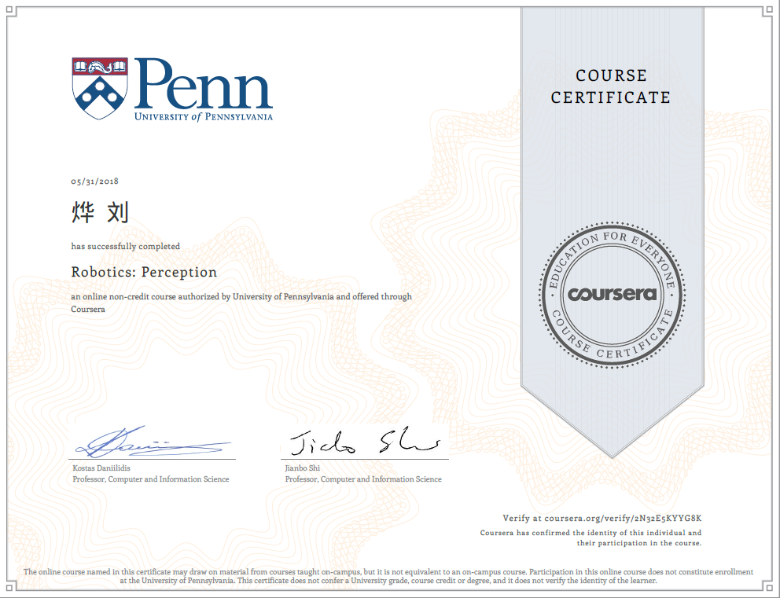

| Course      | Certification |
| ----------- | ----------- |
| **Robotics: Mobility**   Completed at June 19, 2018    4 weeks of study, 2-4 hours/week  [link](https://www.coursera.org/account/accomplishments/verify/UE9FB5TV6V6J)  |  |
| **Robotics: Computational Motion Planning**   Completed at June 11, 2018    3 hours/week [link](https://www.coursera.org/account/accomplishments/verify/U2YBJRMCYS5L)   |   |
| **Robotics: Preception**   Completed at May 31, 2018    4 weeks of study, 3-5 hours/week  [link](https://www.coursera.org/account/accomplishments/verify/2N32E5KYYG8K)|   |
| **Convolutional Neural Networks**   Completed at March 7, 2018    4 weeks of study, 4-5 hours/week [link](https://www.coursera.org/account/accomplishments/verify/FPV4N68BZ68E)   |  |
| **Neural Networks and Deep Learning**   Completed at March 5, 2018 [link](https://www.coursera.org/account/accomplishments/verify/A66ASRR3T24R)  |   |
| **Improving Deep Neural Networks**   Completed at March 5, 2018   3 weeks of study, 3-6 hours per week [link](https://www.coursera.org/account/accomplishments/verify/9GHK77ARJ8LR)  |   |
| **Structuring Machine Learning Projects**   Completed at March 6, 2018   2 weeks of study, 3-4 hours/week [link](https://www.coursera.org/account/accomplishments/verify/ZGNPWFKZ2DRC) |   |
