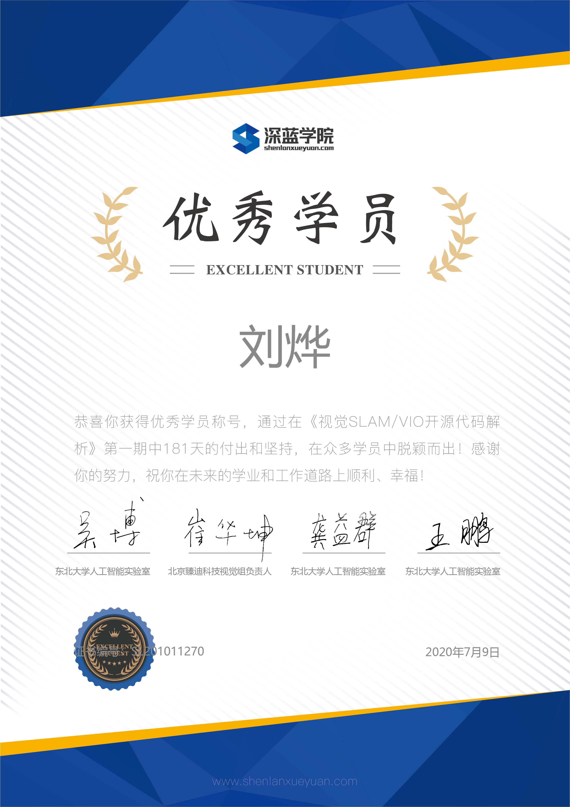

| Course      | Certification |
| ----------- | ----------- |
| **State Estimate of Robotics**    Completed at July 18, 2020    14 weeks of study, 4-6 hours/week  [link](http://www.shenlanxueyuan.com/my/certificate/excellent/1167)  |   |
| **Point Cloud Prcessing**   Completed at July 17, 2020    14 weeks of study, 4-6 hours/week  [link](http://www.shenlanxueyuan.com/my/certificate/excellent/1146)  |   |
| **SLAM Code Study**   Completed at July 9, 2020    25 weeks of study, 4-5 hours/week  [link](http://www.shenlanxueyuan.com/my/certificate/excellent/975)  |   |
| **LIDAR-SLAM**   Completed at Feb 20, 2020    16 weeks of study, 4-6 hours/week [link](http://www.shenlanxueyuan.com/my/certificate/excellent/395)  |   |
| **Probabilistic Graphical Models**   Completed at Nov 29, 2019    14 weeks of study, 4-6 hours/week  [link](http://www.shenlanxueyuan.com/my/certificate/excellent/295)  |   |
| **VI-SLAM**   Completed at Sept 27, 2019    12 weeks of study, 5-8 hours/week  [link](http://www.shenlanxueyuan.com/certificate_share/excellent/214)  |   |
