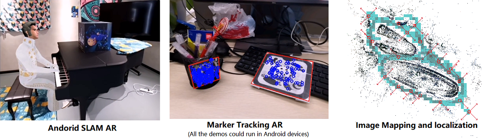
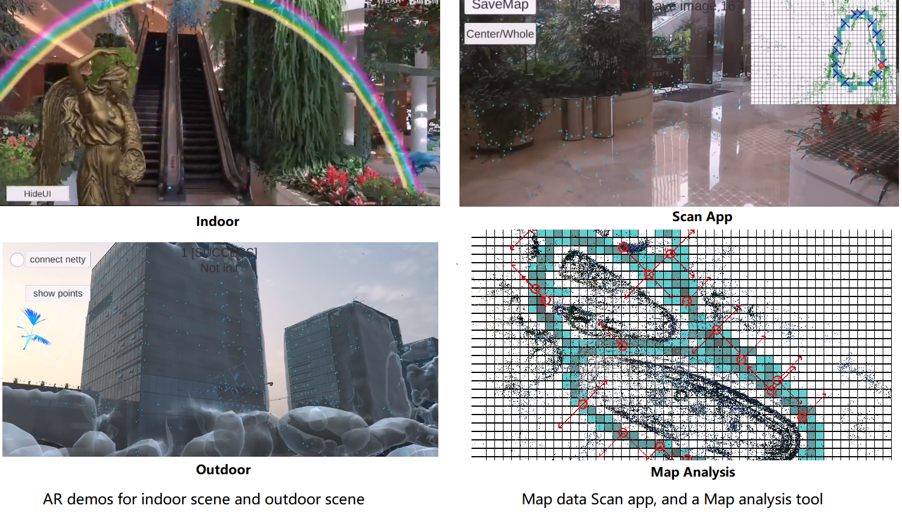
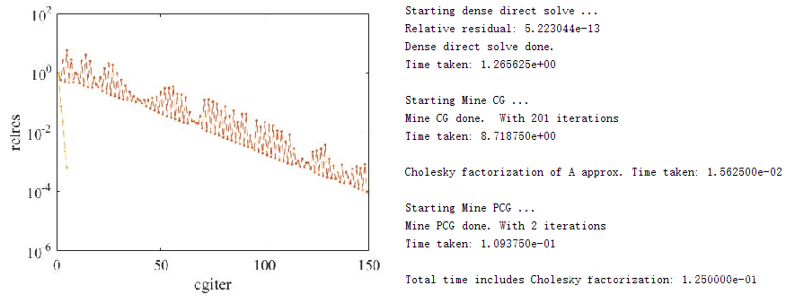
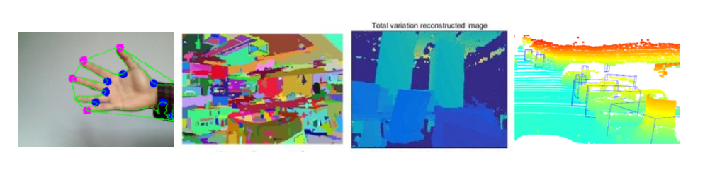

My work in China. ([Documentation with more details](https://vio.readthedocs.io/))
* [Single image based localization algorithm](#lvlp)
* [Mobile visual imu odometry](#lvio)
* [Image marker tracking](#lobj)
* [Other computer vision](#lothers)

    

# Company Introduction

* **UTOPA** : also called 'GaoWei Tech' is subcompany, fully supported by [GTLAND](http://www.gtlandplaza.com/) . GTLAND is a real estate company. It owns four large plazas in the very center of GuangZhou. However, with the change of real estate industry, it is in the urge to transform. It choosed the 'AR' (augmented reality) industry, to fully explore its plazaa.

* **Team** : we have dozen of algorithm engineers, major in Visual SLAM (simultaneous localization and mapping), Visual Deep Learning, and 3D Reconstruction. Support with a few dozens of employees working on Unity3d, and a few dozens working with server back-end. I am part of the algorithm group.

* **My Work** : I am fully charged of one major aspect (**signle image based visual localization algorithm**), and in the direction of two other parts (**mobile device visual SLAM algorithm**, and **6-DOF Image marker tracking algorithm**). The 'productions' of our group are SDKs could be used in Unity Android.

## Single image based large scene localization
I am **fully in charge** of this part. Our system is based on Colmap SFM system, but I have our own modification to make it work for our system. [videos_indoor](https://www.bilibili.com/video/BV1NZ4y1j7Ba/), [videos_ar](https://www.bilibili.com/video/BV1Ci4y1b79V/) and [video_outdoor](https://www.bilibili.com/video/BV1VT4y157NH/).

    

**Algorithm**:

* Offline Mapping:
  * image pretreatments : a fast blur detection algorithm; deep learning based illumination equalization.
  * sensor fusion:
    * imu based scale estimation.
    * lidar based pose graph refinement.
  * dense reconstruction:
    * lidar-image mapping with solid lidar slam, [Using Neuvition](https://www.bilibili.com/video/BV1uJ411C74B/).
    * Deep learning based MVS methods. [articles research](https://docs.qq.com/slide/DUndnS2pwbkRiQmZM) and [DeepMVS test](https://gitee.com/gggliuye/VIO/blob/master/DeepMVS/Result_show.ipynb)
* Online Localization:
  * various feature supported : SIFT, FAST, SuperPoint + SuperGlue.
  * We have further developped an local version of the algorithm (which could run entirely in mobile phone, will with a small loss of robustness). [Local Map](https://vio.readthedocs.io/zh_CN/latest/ServerLocalization/LocalMap.html)
* Application (Unity):
  * Build a scan application (in Android Devices) [demo](https://www.bilibili.com/video/BV1NZ4y1j7Ba?p=6), to simultaneous filtering image, and record IMU data for scale estimation.
  * Build a map analysis interface to help user better build a map with our system.
  * Build a complete Unity Ar application (with automatic image sending system, image filter system, and pose smoothing filter).

Other:
* Work Flow:
  * Linux Algorithm development. C++ development, followed by Java implementation.
  * Build serve, and define interface. Build Android server communication system, and the message encoder/decoder.
  * Build the corresponding Unity project.
* Mapping cloud demo: [Colmap extremely large scene](https://www.voxxlr.com/s/1594282119587)
* Some development log: [ServerLocalization](ServerLocalization/)
* WebGL demo development.

  
Backups

<li><a>Unity Native Plugin Related : baiduyun/UTOPA/Backups/2020_07_UnityNativePluginRender.zip</a></li>
<li><a>Android Netty Library : baiduyun/UTOPA/Backups/2020_03_netty_for_android.zip</a></li>
<li><a>Android Full Library : baiduyun/UTOPA/Backups/2020_07_01_server_arcore.zip</a></li>
<li><a>ArCore based Scene Scan App : baiduyun/UTOPA/Backups/2020_07_Unity_ArCoreMakeMap.rar</a></li>
<li><a>ArCore based Image Localizaton Demo : baiduyun/UTOPA/Backups/2020_07_Unity_ArCoreServerLocalizationApp.zip</a></li>

<!--[Unity Native Plugin Related](https://pan.baidu.com/s/183jBN1hnnLoBpQUpPAiPXg)(lgek) -->
<!-- [Android Netty Library](https://pan.baidu.com/s/1VnAhNK8AIA-AMSBWpVO5PQ) (fc8m)-->
<!-- [Android Full Library](https://pan.baidu.com/s/1vbLbB89j3kDDeYqXf3VH3g)(7km1) -->
<!--[ArCore based Scene Scan App](https://pan.baidu.com/s/1M407vkVbDXXlODUefosWOQ)(db7b)-->
<!--[ArCore based Image Localizaton Demo](https://pan.baidu.com/s/1TrEQaZh85-OnmRMQihfIZg)(q0ez)-->

## Moblie Phone Visual SLAM

We use the ORBSLAM2 base to develop a SLAM system, we our (mostly mine) modification of the code to better suit our project. [videos](https://www.bilibili.com/video/BV1Xk4y1d7ap/)
* Use a marker image to initialize the SLAM system, to have a faster and better initialization, and have an accurate estimation of the scale.
* A system to offer a result with higher frequence, which is realized using optical flow tracking and pose only bundle adjustment.
* A loop clousre system based on marker images (some posters that we can put in our scene), use an other system to obatin the exact pose of all the marker in our coordinate system. As a result, this loop clousre system is perfectly match with one single global map.
* Now is working with PCG (preconditioned conjugate gradient) algorithm to accelerate the SLAM system [my blog](https://blog.csdn.net/weixin_44492024/article/details/106353397) . And also prepare the implementation of incremental bundle adjustment (IBA).

    

**Backups and Documents**:

* [VIO documents](https://vio.readthedocs.io/)
* [PCG Matlab](https://gitee.com/gggliuye/cg_pcg)
* **ORBSLAM2 Android Modified** : baiduyun/UTOPA/Backups/2020_05_ORB-SLAM2-based-AR-on-Android-2020-05.zip
<!-- [ORBSLAM2 Android Modified](https://pan.baidu.com/s/1-WrYRPKdgZunVWLNuc2taA) (ofcd) -->
* **ORBSLAM2 Andorid Corresponding Unity project** : baiduyun/UTOPA/Backups/2020_05_UnityCameraOrbslam.zip
<!-- [ORBSLAM2 Andorid Corresponding Unity project](https://pan.baidu.com/s/1FkF7LoqnwWqEadUlOLygbQ) (fwkx) -->
* **VINS Android Modified** : baiduyun/UTOPA/Backups/2019_vins_android.zip
<!-- [VINS Android Modified](https://pan.baidu.com/s/1aI53TGE-z9quwgVyzrZPxA) (dlhl) -->

**Work Flow**:

* Linux PC algorithm developments.
* Andorid Native Java environment development, and test the algorithms.
* Build Android Library, build corresponding Unity project.
* Test and find problems.

## Marker image based tracking
We have another co-worker deal with it, but I think he didn't do a great job. So I have realize all the algorithms on my own, in my private time. [videos](https://www.bilibili.com/video/BV1Ma4y1t7oD/)
* Single marker detection (version of my co-worker is ORB feature match based, and version of mine is a brute force finder). Mine version could realize a faster and more robust detection (using a Branch-and-Bound optimization structure).
* Multi-marker tracking, based on optical flow tracking and a NCC patch match to refine.
* Structed markers detection and tracking ('structed' means we have prior of the relative poses of the markers). Particularly, I build a system to track a cube object (we track its four side faces).
* Randomly placed marker tracking system.
  * Place the markers randomly at the scene.
  * Using a offline reconstruction algorithm to find their relative poses.
  * Used the localized markers realize AR camera tracking within the scene.
* Cooperate with a third-party SLAM system. Particularly, our system (and the demo video) is a cooperation with ARCORE (from google), and we realize a basic demo which has the potentail to achieve Vuforia's performance.

**Backups and Documents**:

* **Single Tracking** : baiduyun/UTOPA/Backups/2020_05_Marker-based-AR-on-Android-2020-05.zip
<!-- [Single Tracking](https://pan.baidu.com/s/1j5ciMN88E896rxxajtf5qQ)(0dsx) -->
* **Single, Multi, and Cube Tracking** : baiduyun/UTOPA/Backups/2020_05_Multi_Marker-based-AR-on-Android.zip
<!-- [Single, Multi, and Cube Tracking](https://pan.baidu.com/s/1Omtd__yvESLQ-CM5O6-qiw)(cu45) -->
* **Corresponding Unity Project** : baiduyun/UTOPA/Backups/2020_05_multi_marker_arcore.zip
<!-- [Corresponding Unity Project](https://pan.baidu.com/s/18Qi_CYj8HaNe5hXeTcMFZQ) (2c03)-->
* **Random Multi Tracking** : baiduyun/UTOPA/Backups/2020_07_Multi_random_marker.zip
<!--[Random Multi Tracking](https://pan.baidu.com/s/1PFCh3wJ0EkqoUbmnaazinQ)(6s4w)-->

**Work Flow**:

* Same as the former one.

## Other Computer Vision stuff

    

* [Hand Tracking Python](https://gitee.com/gggliuye/Opencv_based_hand_detection) Use traditional Opencv Method and Deeplearning methods repectively for the task of hand detection.
* [Probability Graph model based image segmentation](https://github.com/gggliuye/graph_based_image_segmentation) Use Probability Graph model based algorithm for a simple image segmentation task, a realization of GraphCut algorithm, and an example of L1 heuristic for filling missing data.
* [Lidar SLAM](https://github.com/gggliuye/LidarSlam) : Try to realize an simple ICP based lidar odometry algorithm. And try an mapping algorithm using part of the result from SFM visual reconstrction. some clouds :[RealSense lidar pop art](https://www.voxxlr.com/s/1594283047256) and [RealSense lidar office](https://www.voxxlr.com/s/1594283095264)
* [Point Net ++ Kitti Detection Test](https://github.com/gggliuye/PointNetKitti) : Using point cloud clustering algorithm for object detection, and using a Point Net++ network for object classification.
