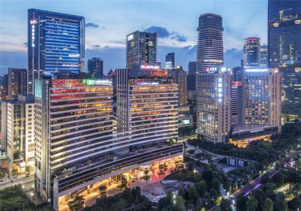

# Company Introduction (updated 2020/07)

* **UTOPA** : also called 'GaoWei Tech' is subcompany, fully supported by [GTLAND](http://www.gtlandplaza.com/) . GTLAND is a real estate company. It owns four large plazas in the very center of GuangZhou. However, with the change of real estate industry, it is in the urge to transform. It choosed the 'AR' (augmented reality) industry, to fully explore its plazaa.

* **Team** : we have dozen of algorithm engineers, major in Visual SLAM (simultaneous localization and mapping), Visual Deep Learning, and 3D Reconstruction. Support with a few dozens of employees working on Unity3d, and a few dozens working with server back-end. I am part of the algorithm group (or should I say the 'head' without a offical title).

* **My Work** : I am fully charged of one major aspect (**signle image based visual localization algorithm**), and in the direction of two other parts (**mobile device visual SLAM algorithm**, and **6-DOF Image marker tracking algorithm**). The 'productions' of our group are SDKs could be used in Unity Android.

# Summary and Backups (updated 2020/07)

The three directions of my work.

### Moblie Phone Visual SLAM
We use the ORBSLAM2 base to develop a SLAM system, we our (mostly mine) modification of the code to better suit our project. [videos](https://www.bilibili.com/video/BV1Xk4y1d7ap/)
* Use a marker image to initialize the SLAM system, to have a faster and better initialization, and have an accurate estimation of the scale.
* A system to offer a result with higher frequence, which is realized using optical flow tracking and pose only bundle adjustment.
* A loop clousre system based on marker images (some posters that we can put in our scene), use an other system to obatin the exact pose of all the marker in our coordinate system. As a result, this loop clousre system is perfectly match with one single global map.
* Now is working with PCG (preconditioned conjugate gradient) algorithm to accelerate the SLAM system [my blog](https://blog.csdn.net/weixin_44492024/article/details/106353397) . And also prepare the implementation of incremental bundle adjustment (IBA).

<!--  -->
**Backups and Documents**:

* [VIO documents](https://vio.readthedocs.io/)
* [PCG Matlab](https://gitee.com/gggliuye/cg_pcg)
* ORBSLAM2 Android Modified : baiduyun/UTOPA/Backups/2020_05_ORB-SLAM2-based-AR-on-Android-2020-05.zip
<!-- [ORBSLAM2 Android Modified](https://pan.baidu.com/s/1-WrYRPKdgZunVWLNuc2taA) (ofcd) -->
* ORBSLAM2 Andorid Corresponding Unity project : baiduyun/UTOPA/Backups/2020_05_UnityCameraOrbslam.zip
<!-- [ORBSLAM2 Andorid Corresponding Unity project](https://pan.baidu.com/s/1FkF7LoqnwWqEadUlOLygbQ) (fwkx) -->
* VINS Android Modified : baiduyun/UTOPA/Backups/2019_vins_android.zip
<!-- [VINS Android Modified](https://pan.baidu.com/s/1aI53TGE-z9quwgVyzrZPxA) (dlhl) -->

**Work Flow**:

* Linux PC algorithm developments.
* Andorid Native Java environment development, and test the algorithms.
* Build Android Library, build corresponding Unity project.
* Test and find problems.

### Marker image based tracking
We have another co-worker deal with it, but I think he didn't do a great job. So I have realize all the algorithms on my own, in my private time. [videos](https://www.bilibili.com/video/BV1Ma4y1t7oD/)
* Single marker detection (version of my co-worker is ORB feature match based, and version of mine is a brute force finder). Mine version could realize a faster and more robust detection (using a Branch-and-Bound optimization structure).
* Multi-marker tracking, based on optical flow tracking and a NCC patch match to refine.
* Structed markers detection and tracking ('structed' means we have prior of the relative poses of the markers). Particularly, I build a system to track a cube object (we track its four side faces).
* Randomly placed marker tracking system.
  * Place the markers randomly at the scene.
  * Using a offline reconstruction algorithm to find their relative poses.
  * Used the localized markers realize AR camera tracking within the scene.
* Cooperate with a third-party SLAM system. Particularly, our system (and the demo video) is a cooperation with ARCORE (from google), and we realize a basic demo which has the potentail to achieve Vuforia's performance.

### Single image based large scene localization
I am fully in charge of this part. Our system is based on Colmap SFM system, but I have our own modification to make it work for our system. [videos_indoor](https://www.bilibili.com/video/BV1NZ4y1j7Ba/) [videos_ar](https://www.bilibili.com/video/BV1Ci4y1b79V/) [video_outdoor](https://www.bilibili.com/video/BV1VT4y157NH/).
* [My work of the first period](https://vio.readthedocs.io/) is mostly to study and to prepare the modules. And we have built all the basic algorithm interface of C++, C#, and java to support.
* We use a fast blur detection algorithm to reject bad image frames.
* We have built a IMU based scale estimation algorithm.
* We have built a system to allow to use a third-party lidar device to help optimize our map.
* We are now developping a deep learning based feature detection algorithm to deal with the illumination changing.
* We are now developping a solid lidar based visual-lidar system to get a better and more dense result.
* We are working with Deep learning based MVS methods. [articles research](https://docs.qq.com/slide/DUndnS2pwbkRiQmZM) [DeepMVS test](https://gitee.com/gggliuye/VIO/blob/master/DeepMVS/Result_show.ipynb)

### Other Computer Vision stuff

Backups and Documents:

* [Hand Tracking Python](https://gitee.com/gggliuye/Opencv_based_hand_detection)
* [Probability Graphy model based image segmentation](https://github.com/gggliuye/graph_based_image_segmentation)

# Diary
Some the develop diary.
Most of them are in my private workfile (invisible here)

[Diary](Diary/)

# ServerLocalization

[ServerLocalization](ServerLocalization/)

## Mappings

[Colmap extremely large scene](https://www.voxxlr.com/s/1594282119587)

[RealSense lidar pop art](https://www.voxxlr.com/s/1594283047256)

[RealSense lidar office](https://www.voxxlr.com/s/1594283095264)

# WebGL demo
(worked with my own effort)
* First demo : use threejs to load and show a point cloud (which I encoded into json form).
* Second demo : use threejs to show a computer vision algorithm based 3d reconstruction.
[WebGL demo](../WEBGL/threejs)

## Home
[Home](../)
