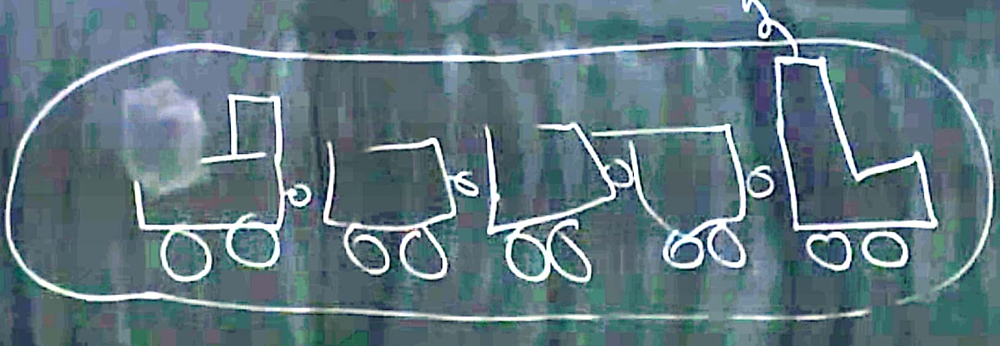
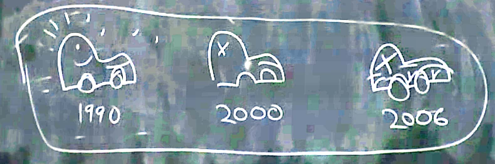

## Identity

**We assume the soul doesn't exist in the following sections**.
What is it, for me, to survive a period? Is the person here next week, the same person? For me, to survive next week. And think for a longer period, for an example 40 years. For clearify them, we must figure out some concepts : Identity across space and time, personal identity.

### Space Identity

Example : the extended-through-space train. We pointing the locomotive to identify the same train as we pointing the caboose. *Are they the same train?*

<!--  {: .mx-auto.d-block :} -->

What if some part of the train is blocked.

If we have X-ray to look through the block.
* It could be the train is seperate in the middle, there are actually two trains.
* Or it is the same extended-through-space object.

### Time Identity

Example: the extended-through-time car. when pointing the car, we are not pointing the slice of car, but the entire extended-through-time object. The slices aren't the same, the cars are the same.

Same for the "blockage", if we lost the car in a period, then find 'the car'. If we cannot figure out what happened this period, we cannot sure if it is the same extended-through-time car, or it is another car.

And we may ask : **What makes two stages, stages of the very same thing?**. The trian connection make them the same object.  
* What is the metaphysical glues for the extended-through-time car : being the same hunk of stuff (even the consistuent atoms are changed, even bigger parts).
* How many changes of the consistuent parts can you have and still be the same hunk of stuff ?

### Personal Identity - Soul

Is SK 2007 the very same person as **the extend-through-time person** (*space time worm*) that you got in mind when pointing to Mr.X 2050 (we are not asking the person stages/slices). Answer : *it depends on whether the stages are glued together in the right metaphysical way.*
( *Can we survive the death of the body?* to answer it we need to clear about what does it take to have identity across time.)

* For dualism, the key is having the same soul. Think about God takes my soul, and replace it with another soul, with all my memories, my experiences, my desires, etc , pluged in. In the dualism view, he won't be me, as he has a different soul. While there will be no way at all for him to know that. *How do we know if it happens?* (raised by John Locke) . It is not plausible. So we concludes here, even if the soul do exists, they may not be the key to personal identity.

### Personal Identity - Body

The body theory of personal identity.  That same body means same person.  In that case(not contradict with dualism), we could still "survive" the death of the body, if we believe in body resurrection.
* Support example, the jeweler  take down the watch then fix it.  
* Objection, I build exact the same woldden tower (duplication) as my son did. Can the body be decomposed then be recomposed. *we don't have the every same object as we start with.* (from Van Inwagen) So even the judgement day comes, that God reassembled all the molecules, that won't be the every same body. I will have a duplicated me, but not me.

Obviously we can accept some change of the body. But which changes in the body make a different body, and which changes make for the same body. Not all the parts of the body are equally important. The most important part is the brain. **Enough part of the brain** to keep the personality.

### Personal Identity - Personality

* Think about organic transplant. You get a brain transplant, it actually someone else doing a torso transplant.
* Is there redundancy in the brain? It seems that some part of the brain can be lost, to still keep or person identity.

The Prof thinks the best part of the body view, is the brain view. Because the brain is the house of personality. So why not say the key to person identity is the sameness of personality (instead of body): believes, desires, goals, fears, ambitions, memories, etc. Sameness of body gives the same personality, and same personality gives the same identity. Personality and body could come apart. Can same personality has different body? This theory can be accepted by both the physicism and the dualism.

As our memories (and other parts of personality) are constantly changing, so the personality theory only requires **gradual overlaps (evolving)**,  accepting some changes of the elements.

### Imagination experiment

Imaging this is happening to you (the separation of body and personality), and ask yourself, which one do you want to (not) be tortured. This will give you some evidence that which one do you take to be "you".

**Imagination "Mind transform machine".**
* *Case 1* My mind and Linda's body, Linda's mind and body. Which one do I choose to be tortured. It seems that we are following the "personality theory" to make our decisions.
* *Case 2* Mad scientist wants to torture me, but give me perfect amnesia before. He will drive me crazy, and delude me into thinking I am Linda, with all Linda's memories (so this won't be my personality, it will be Linda's personality that will be tortured). After he will do the same thing to Linda (fill Linda's body with my personality). However, in this expression none of these makes me feel well. It seems that we are following the "body theory" to make our decisions.

They are actually the very same case, being told in different ways. This method can not offer us a way to choose between body view and personality view.

**Another approach : possession** : start by raising a certain philosophical objection to the personality theory.

* Somebody in an insane asylum who think he is Napoleon, but he doesn't have Napoleon's personality.
* Assume he has Napoleon's personality (the complicate set of beliefs, memories, etc), and he has no original memories. *Is he Napoleon?*
* If this happens to two people. There is no reason to feavor any one of the two. Or maybe Napoleon splitted into two "Napoleon". Or neither is Napoleon (with the personality theory get rejected).

We may need to fix the personality thoery to deal with the splitting cases : **no-competitors clause** (no branching rule). Same personality same person as long as there's no branching. If there's branching neither of the branches is me.
Objection , this rule is bizzard: whether I am myself depends on if there exist another "me" else-where.

**Body Splitting in sci-fiction.** In this case, the body theory faces the same problem.
Same thing happens to "Soul theory", while following Plato's theory soul cannot be splitted but we cannot say.

### It dosen't really matter

What matters in survival? Imagining the reincarnation of the soul (suppose it is possible), with the soul being scrubbed completely clean, like a blackboard been completely erased. This survial doesn't give me anything that matters to me. Same happens to the body theory.

**I want to survive with a similar personality.**
Even if my body, my brain or my soul couldn't survive. My personality is all what matters for me. If my personality continue to exist some where, it gives what matters to me.
