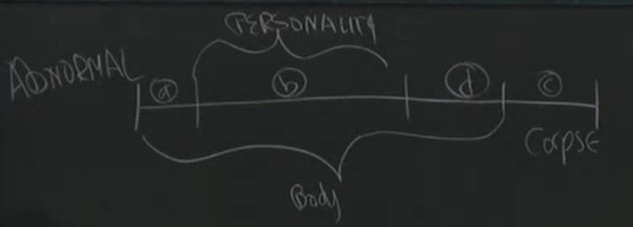

## what is death?

Human is a P-functioning body. Which functions are crucial in defining the moment of death (body functions / personality functions)?

* In C, I exist but not alive, in cropse.
* In D, I alive (bodily) but not as a person. There is no personality exists.
* In A, it is my body, but not me.

Is there something immoral about removing the organs during phas D, when the person is dead and the only thing that's still alive is the body.

**Death: the end of P-functioning** :
* Question: While you are not dead all the times when you are unconscious and not dreaming.
* Proposal: When the lack of P-functioning is temporary, you are still alive. But what will that be if God resurrects the dead on Judgment day.
* Proposal: When you are capable of engaging P-functioning, you are still alive. For the case, someone in coma.
