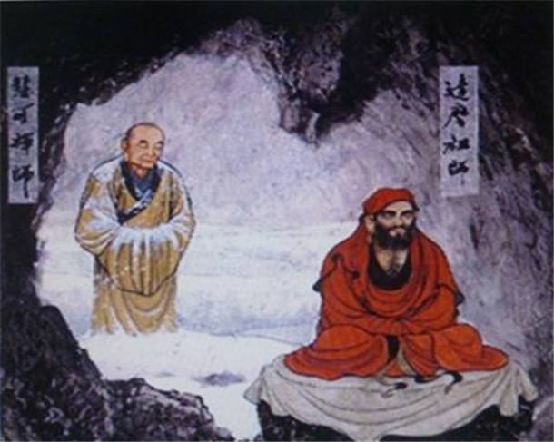

I shouldn't "say" anything, actually, as "The DAO that can be told is not the eternal DAO". So we have " The silent majority", which if all the wise men are scilent, there won't by any people to lead the public. Like <a href="https://en.wikipedia.org/wiki/Bodhisattva">Bodhisattva</a> , who choose to guide everyone into <a href="https://en.wikipedia.org/wiki/Nirvana">Nirvana</a> instead of being <a href="https://en.wikipedia.org/wiki/Buddhahood">Buddha</a> immediately. Sometime, we do need to talk, even if the words could be misleading.

We are always told that TIME is a great deal, we shouldn't waste any time. We must devote all our time and effort into development either personal or social. While, we may ask, why time matters, and to who we are competing ?

First we should understand that time is a social convention (the "time" which most of us used or understand. Not the "time", the fourth dimension in a physics world). The concept is created for the sake of convenience, for a better running social. And it generates the concept of "yesterday", "today" and "tomorrow".
It is MAYA based on <a href="https://for-fun.readthedocs.io/zh_CN/latest/AW/3Time.html">Alan Watts lecture</a> .
