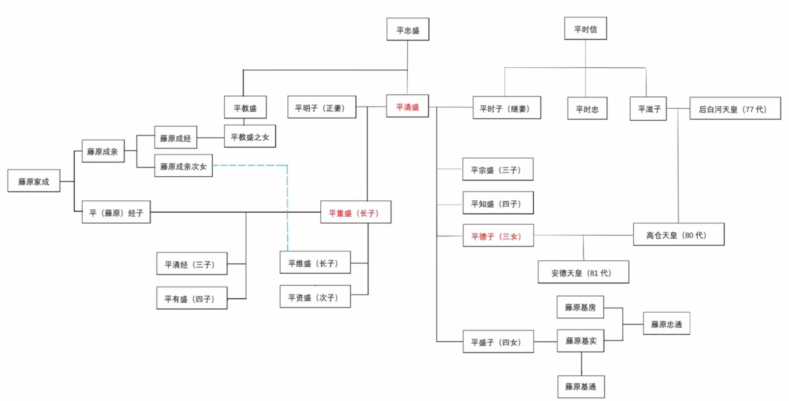
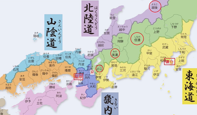
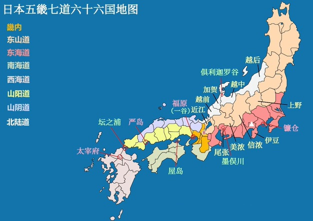
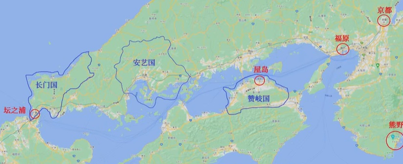

祗園精舎の鐘の声、
諸行無常の響きあり。
娑羅双樹の花の色、
盛者必衰の理をあらはす。
おごれる人も久しからず、
唯春の夜の夢のごとし。
たけき者も遂にはほろびぬ、
偏に風の前の塵に同じ。

祗园精舍钟声响，诉说世事本无常。
沙罗双树花失色，盛者必衰若沧桑。
骄奢淫逸不长久，好似春夜梦一场。
强梁霸道终覆灭，恰如风前尘土扬。

【【平家物语综评01】山田尚子的奇迹！改编的艺术！叙事和主旨分析！[松野小路]-哔哩哔哩】 https://b23.tv/Fp76BtW

* 1132年，<u>殿上的暗算</u>，平清盛之父平忠盛，受众公卿嫉妒木刀暗算。

## 平家与源家：
* 1156年，崇德上皇与后白河天皇的保元之乱中，源义朝与平清盛助后白河天皇获胜。但源义朝未被重用心生不满。
* 1159年，联合藤原信赖拘禁天皇引发平治之乱。平清盛平重盛平定战乱。源义朝之子源赖朝、源义经幸存，被流放伊豆。
* 1164年，平清盛将9岁四女盛子嫁给22岁的藤原基实。1166年基实去世，被清盛利用，庄园归于盛子。1179年盛子去世。

## 第一、二集背景：
* 1168年: 平清盛突发疾病，痊愈后出家，从京都迁居福原，发展宋朝贸易。平重盛继承家主主持事务，但是平清盛仍然掌权。
* 1169年，嘉应强诉。朝廷与延历寺僧众矛盾（僧兵导致的动乱）。平家守卫皇宫，但偏向清盛出家的延历寺。后白河被迫流放成亲—后白河与平家矛盾。
* 1170年7月：“殿下乘合”，重盛次子平资盛与摄政大臣藤原基房相遇，资盛未行礼被教训。清盛私行报复。后白河法皇77天皇不满。

* 重盛信佛，供奉佛像放常明灯笼。
* 清盛与戏女衹王和阿佛。

## 第三集
* 1176年夏，西光之子师高、师经于僧人矛盾，火烧白山寺，“鹈川合战”。由此引发僧众强诉。
* 1177年4月13日，事态升级，“安元强诉”，神舆被射中，被迫答应强诉。1177年4月28日，定都“太郎烧亡”大火灾，被视为射中神舆的报应。
* 1177年5月，（平滋子过世第二年，后白河与平家矛盾积累）后白河与成亲、西光等人于鹿谷山庄密谋打倒平家。安元强诉的余波，导致鹿谷密谋计划行动被搁置。
* 1177年6月，鹿谷密谋败露（多田行纲告密平清盛），清盛抓捕西光、成亲，在重盛以死相谏后，放弃软禁后白河。后西光被斩，成亲成经等被流放鬼界岛。后白河内心抑郁，懒于朝政，热心玩乐。

* 重盛与宗盛：重盛为长子，清盛娶平时子后生宗盛，由于时子地位更高，重盛地位受宗盛威胁。
* 建礼门院右京大夫：诗词，《建礼门院右京大夫诗集》上卷平家繁荣，与姿盛的恋情；下卷平家衰落，回忆姿盛。
* 樱梅上将：1176年，后白河法皇50岁生日，樱梅上将-平维盛舞技出色。
* 葵前与小督，和高仓天皇的儿女情长，受平家干涉。

## 第四集

* 1178年2月，德子怀孕，因恶灵附体，孕期身体越发不适。
* 1178年5月，姿盛、伊子、藤原隆信（“歌仙”、绘画）的三角恋情。
* 1178年7月，清盛为祈求德子安产，赦免了成经和康赖。（卒都婆）（俊宽蹬足）1178年10月，赦文传到鬼界岛，俊宽未被宽恕，独自留下，悲痛欲绝。
* 1178年12月22日，德子顺利产下安德天皇。

**平盛子去世，平重盛病逝**
* 1179年5月，重盛噩梦，预见平家命数已尽，第二天便将无文太刀赐予维盛（原作在参拜之后）。
* 1179年6月，京都刮起旋风，被占卜为不祥之兆。
* 1179年7月23日，平盛子逝世。
* 1179年7月底，旋风后，重盛前往熊野神社为平家祈福，回程途中维盛衣服沾湿，如同丧服。
* 1179年8月参拜回京的重盛病重，后白河法皇慰问重盛。重盛放弃治疗并出家。
* 1179年9月2日，重盛去世（琵琶继承重盛的亡者之眼）。

## 第五集

* 1179年11月，清盛与后白河长久的积怨彻底爆发，清盛发动“治承政变”。清盛的核心理由：盛子庄园、重盛领地、基通职位——都被后白河夺取。免除非平氏官员，软禁后白河于鸟羽殿。
* 1180年2月，高仓天皇被迫退位，并参拜严岛神社，但是引起僧众暴乱（背后为以仁王）。1180年3月，安德天皇继位，背后清盛掌权。
* 1180年5月，以仁王（后白河三子）觊觎皇位联合源赖政起兵，联络僧院僧兵（园城寺、兴福寺）。1180年6月，以仁王计划泄密、遭遇追捕，在逃亡途中，双方交战于宇治桥——“宇治桥合战”。源赖政父子自裁，以仁王在继续前往奈良途中中箭身亡。1180年6月，以仁王死后，园城寺因支持以仁王，被平重衡带兵攻打、放火焚毁。

高仓温柔。红叶：高仓天皇爱红叶。宫装：赠女官衣服。藤原殖子。

## 第六集

迁都和各地起兵反平。

* 1180年5月底，源赖朝收到以仁王的令旨。
* 1180年9月，迁都福原（平氏据点），远离各方威胁。但是激发了各方势力的怨恨。
* 1180年9月，伊豆旧豪族势力受到平家威胁，源赖朝于伊豆举兵。文觉（1953年电影《地狱门》），劝说源赖朝起兵，之后成为镰仓幕府的重要人物。
* 1180年9月14日，源赖朝于石桥山惨败于平氏军队。1180年10月，源赖朝于安房积聚兵力，入住镰仓，新建立了独立的政府机构。
* 1180年10月，平维盛率大军讨伐源赖朝。
* 1180年11月，平家（数量大但是军心涣散）于富士川不战而败，平家车马劳顿，军心动摇。水鸟惊动平家军队。

小故事历史：
* <u>清经、敦盛、重衡</u>在海岸边吹笛赏月。清经投海而亡。1184年敦盛之死，熊谷。重衡，被赖朝软禁，1185年被斩。
* “笼之御所”清盛幽静法皇。
* 高仓病重，迁居福原后水土不服。
* 妖怪事件。清盛遇目竞，松树枯萎，平家武士的怪梦。

## 第七集

* 1180年12月，源义仲、近江源氏举兵，南都北岭恶僧作乱。
* 1180年12月迁都回京，为了处理恶僧作乱和源氏叛乱。
* 1181年1月，资盛、清经初阵，成功镇压近江源氏起兵。
* 1181年1月，南都烧讨事件。严厉寺也加入（园城寺、兴福寺）恶僧，僧众被平家击败。重衡因烧毁寺庙成为佛教之敌。
* 1181年1月30日，高仓上皇驾崩——德子的转变。（镜饼，新年祭神）
* 1181年2月，德子反抗清盛，拒绝侍奉后白河。御子姬君入宫侍奉后白河，然而不受后白河喜爱。

* 1181年3月初，各地势力举兵反平。
* 清盛夫人平时子噩梦。
* 1181年3月20日，清盛因热病去世，骨灰奉于经岛，送葬之日府邸着火。其三子平宗盛接替家主，宗盛无才，其后平家势衰，很快灭亡。

琵琶被赶出平家，琵琶也需要转变。获得母亲线索，前往越后国，家猫是奈良时代传到日本的，当时猫是贵族宠物。

## 第八集

* 1181年4月，重衡和维盛在墨俣川大破源行家军队（独立源赖朝独立建立势力）。
* 1181年7月，越后守城资永讨伐源义仲，拿下燧城，后进入加贺国，位于越后的义仲援军赶来。
* 1181年底到1182年，源氏内斗。义仲（富有军事才能，图谋北陆道）——赖朝。义仲将长子送往镰仓以稳住赖朝。
* 1183年4月，平家起兵（军心涣散没有斗志），决定先夺回北陆道，再讨伐源赖朝。
* 1183年6月，维盛与义仲于加贺与越中的交界处交战，<u>大败于俱利迦罗谷</u>。6月底，维盛残军与义仲交战于加贺国筱原，平家再度败北，斋藤实盛（义仲儿时救命恩人）阵亡。
* 1183年7月，维盛残军返京。很快义仲率军抵达近江国，并争取到严厉寺支持。
* 1183年8月，宗盛带着安德天皇与三神器全族逃往西国，徐图再举，经过福原至九州。出逃前夜，后白河出逃鞍马寺脱离平家控制。
* 1183年8月底，义仲入京，义仲大军粮草不足，组成复杂，源氏军队在京中胡作非为。

北条政子，赖朝之妻，与赖朝两情相悦，赖朝获得北条家支持。

赖朝：冷酷独裁。

三家：西国平家，京畿义仲，关东赖朝。

## 第九集

* 1183年9月，后白河奖赏义仲，除去平家官职。1183年9月8日，后鸟羽天皇登基。1183年10月，后白河命义仲讨伐平家。
* 1183年10月，平家在九州受到旧背叛和驱逐，漂泊海上，<u>清经投海自尽</u>。1183年10月底，平家入驻四国赞歧国屋岛，逐渐恢复势力。
* 1183年11月，后白河与源赖朝交好。朝廷对义仲的不满与日俱增，义仲山中长大不得体，军队组成复杂，劫掠京都。。赖朝请求皆合情合理，得到朝廷好感，朝廷进一步正式将关东地接交给赖朝。
* 1183年11月24日，<u>水岛合战</u>，义仲大败于平家。1183年12月，赖朝派义经上洛，义仲火速返京。1184年1月3日，<u>法主寺合战</u>，义仲抗拒后白河命令，义仲幽禁后白河和后鸟羽天皇——讨伐院厅，义仲失去人心。
* 1184年2月，平家势力重回福原。
* 1184年3月，<u>宇治川合战</u>，义仲负于源赖朝大军，义仲在逃亡途中阵亡。
* 1183年3月20日，<u>一之谷战役</u>，东西战线同时进攻，义经奇袭，平家大败于源赖朝大军。<u>平敦盛阵亡</u>，平重衡被俘。

义经母为美人被清盛看重，寄宿清盛府中。7岁被送入京郊鞍马寺修行。16岁投奔奥州的藤原秀衡。1180年响应赖朝号召，增援赖朝，但并未受到信任。直到1183年作为先头部队上洛，开始登上历史舞台。最终兄弟反目，赖朝逼义经于1189年杀死妻女后切腹自尽。

后世研究者对一之谷不同看法，实际是多田行纲的奇袭。

敦盛vs熊谷，熊谷看见少年年轻俊美，想放人一马，但敦盛英勇就义，熊谷生向佛之心。
忠度vs冈度，平忠度之死。

## 第十集

一之谷战役之后。平家则退回赞歧国屋岛修养生息。但是平家仍然掌握自己的舰队，获得喘息空间。

* 1184年4月，平重衡被俘虏，送往镰仓，赖朝欣赏重衡。后被斩首，妻子、女官、千手御前都削发为尼。
* 1184年5月10日，维盛脱离平家，出家后，于熊谷投海自尽。5月底琵琶回到屋岛平家。
* 1184年9月，后白河封源义经为检非违使（俗称“判官”），管理京都治安。
* 1184年10月，源范赖远征西国，久攻不下。
* 1185年3月22日，<u>屋岛合战</u>，后白河命义经再次出征，没有进攻西国，而是直取屋岛。
* 1185年5月2日，<u>坛之浦决战</u>。

<u>赖朝和义经的矛盾</u>。赖朝认为需要建立武士政权，以求独立于朝廷。义经则忠于朝廷和天皇。
赖朝-政治家，义经-军事家。

坛之浦决战，资盛有出走和参战两种说法。

## 第十一集

* 屋岛合战失利，平家陷入绝境。各家势力倒戈，加入源氏，但平家仍然拥有三神器，源氏大军也面临补给问题，同时源家缺乏水战经验。
* 坛之浦洋流。平家错过了进攻时机，给源家了解水文的时间。
* 海豚自源氏一方游过平氏，洋流方向，平家大败。义经八艘跳、知盛抱锚跳海。
* 1185年4月25日，<u>德子投海</u>。坛之浦的海上战役，源平合战最后一站。清盛之妻平时子，协抱8岁外孙安德天皇，“波涛之下也有皇都”而投海。平德子，其女，也欲跳海，被源氏救出，出家为尼孤苦一生。

* 源赖朝追杀平家（男性）后人。
* 1199年1月13日，源赖朝去世。
