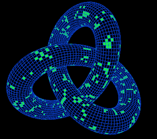

[Watch Daniel Sloss: Live Shows Netflix Official Site](https://www.netflix.com/hk/title/80223685).
Jigsaw (breakups 350K+ Divorces 600).

无论是最近看的拼图的比喻，或者历史唯物主义的思想，又或者表观遗传的理论，人类行为学的研究，我一直认为我的一切都是由环境导致的。
由围产期的环境，由家庭环境，由上学之后的同龄人环境，由社会环境，由我遇到的那些好朋友，遇到的那些对我生命留下刻印的人。由社会或者由人际关系，它们这些构造了现在的我。

但是从这里面孕育出来的“我”，却感受到了和周围环境的断裂。我能感觉到有时候社会关系、我周围的人对我的期待，和我“自己”的想法是不一样的。
这里可能有两个问题，一个是这个矛盾感的问题，还有一个是我“自己”的想法究竟是什么的问题。（当然这两个可能是一个问题）

如果这个矛盾来自于一个虚幻的或者是畸形的“自我”，解决了“自我”可能就解决了矛盾。
* 我可以走中国传统的路子，把自我意识溶解在集体意识，或者溶解在自然中。没有了“自我”，也就没有谁是在感受到矛盾了。但是这条道路毕竟太极端了（虽然摆烂很吸引人），我还是想在有能力的时候，再努力一下，尝试一下其他的道路。
* 或者我永远不可能把握我自己？似乎有一种根深蒂固的思想，认为一个东西无法超出它自己的一个限度。但是为一直认为哪怕很简单的一个东西，也能派生出无限的可能性（比如[Conway's Game of Life](https://en.wikipedia.org/wiki/Conway%27s_Game_of_Life)）。一件事物的可能性，不会被它自己本身的复杂程度限制。我们是可以超越自身的复杂度的限制，达到更高的层次的。

如果先不考虑“我”的问题，而假设这个存在，是合理的，而能够对自己的情绪有一定的把握。也就是说这个矛盾是存在的，而且不是来源于一个畸形的自我的。
那么这个矛盾可能来自于什么？

* 这个矛盾可能来自更深层次的社会关系。由于拼图只是平面的，而且是马尔科夫的（如果当前的状态固定了，那么它未来的发展就和过去没有关系）。但是我们的社会关系可不止这么简单，我们的社会关系是混沌的不能被把握的，那么势必会有偶然性、有矛盾在其中。
  * 我们的社会关系首先不是平面的，甚至不是三维的，而是具有更高的复杂性的。
  * 另外我们的社会关系是时间的，不能只考虑当下，而需要考虑过去、需要考虑可能的未来。
* 不过如果简单停止在这一步，那么和摆烂的不可知论就没有区别了。我们应该更进一步，在混沌中寻找规律（就像数学中的非线性系统的混沌理论一样）。
  * 但是为了能够理顺这么复杂的系统，仅仅凭借感觉大概是不够的，应该也需要一种方法论（一种对应于数学中混沌理论的社会关系的方法论）。
  * 为觉得大概从图理论中也能够得到参考。
